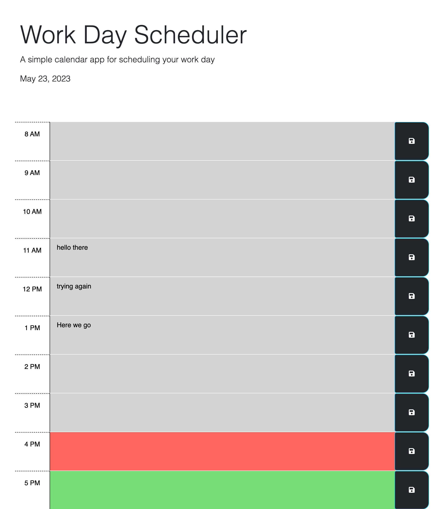

# Module-5

## Module 5 challenge

## User Story

* As an employee with a busy schedule, I WANT to add important events to a deily planner
    SO THAT I can manage my time effectively.

## Acceptance Criteria

* Given I am using a daily planner to create a schedule

* It is done when I open the planner and see the work day schedule

* It is done when the current day is displayed on the top

* It is done when I see the hour time blocks

* It is done when the past time is colored gray, the present time is in red and the future time is in green

* It is done when I click on a time block, I can enter in an appointment or event

* It is done when that appointment or event is logged to the local storage.

## Assets

* References used in the creation of the module

* Used YouTube to see how coding was done.

* Used Code Academy for JS Coding

* Used W3 Schools for JS coding

* KlyDesign was viewed on structure of the code in JS and HTML

* HTML and CSS for dummies was referenced.

* Stack Over flow was used to get time blocks and event local storage ideas on how to code.

* MDRN documents was referenced to help code.

* Git Hub Topics were referenced on JS code and HTML

